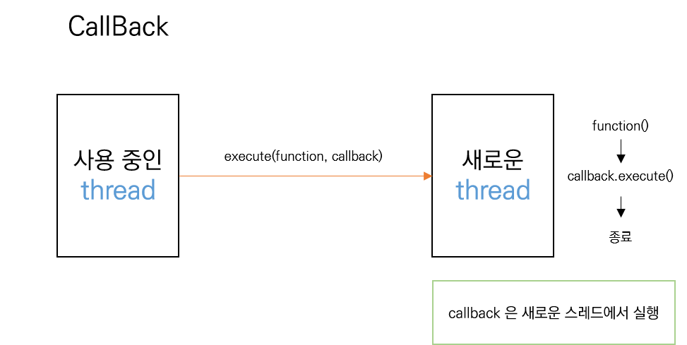

# java 로 비동기를 구현해보자

## Future 와 Callback

자바에서 비동기를 구현하는 방법으로 `Future` 와 `Callback` 을 사용합니다.
자바나 라이브러리에서 제공되는 구현체들은 복잡하지만 이해를 위해 쉽게 예제를 구현해 보았습니다.

이 둘은 쓰레드를 생성한 후 함수를 실행하여 사용 중인 쓰레드를 차단 없이 지속적으로 사용하려는 목적을 가집니다.
이때 결과값을 처리하는 방법에 따라 `Future`와 `Callback`으로 나눌 수 있습니다.

### Future

- [간단한 Future 구현 예제](/async/jun/example/future/FutureExample.java)

> 자바는 1.5 버전에서 Future 를 도입했는데 구현체로 FutureTask 를 제공합니다.

새롭게 생성한 스레드에서 프로세스를 실행한 후 결과값을 공유 자원에 저장하고 가져오는 방법을 `Future`라고 합니다.
예제에서는 메서드를 실행 후 공유 저장소로 사용되는 `Future`인스턴스를 반환하도록 구현합니다.

> 쓰레드는 JVM 의 Heap 메모리를 공유하기 때문에 Future 인스턴스의 주소를 실행 중인/새로운 쓰레드 모두 공유할 수 있습니다.
  
반환받은 Future 에서 **get()** 메서드를 사용하면 새로운 쓰레드에서 처리된 결과값을 기다렸다가 받을 수 있습니다.
이때 사용 중인 스레드는 **차단**됩니다.

### Callback

- [간단한 Callback 구현 예제](/async/jun/example/callback/CallBackExample.java)

Callback 은 **새로운 스레드**에서 프로세스를 실행 후 파라미터로 전달받은 **callback 클래스의 메서드를 실행**하는 방법입니다.
새로운 스레드에서 callback 메서드가 실행되며 **메인 스레드는 차단되지 않고** 본 작업을 계속 수행합니다.

이 방법의 예제는 다음과 같습니다.

### Future vs Callback

이 둘의 큰 차이점은 작업한 결과를 처리하는 대상이 누구인가 하는 점입니다.(`사용 중인 쓰레드` 혹은 `새로운 쓰레드`)
만약 연산 결과를 주 실행 쓰레드에서 사용해야 한다면 `Future`를, 영향이 없다면 `Callback` 을 사용하면 됩니다.

## ListenableFuture

- [간단한 ListenableFuture 구현 예제](/async/jun/example/asyncFuture/ListenableFutureExample.java)

guava 는 이 둘을 혼합한 [ListenableFuture](https://github.com/google/guava/wiki/ListenableFutureExplained) 를 제공합니다.
([스프링은 4.0](https://docs.spring.io/spring/docs/current/javadoc-api/org/springframework/util/concurrent/ListenableFuture.html)
부터 제공하고 있습니다.)

이 방법의 핵심은 작업이 완료되었을 때 실행되는 `callback 을 나중에 등록할 수 있는 것` 입니다.
새로운 쓰레드에서 프로세스 처리 후 바로 실행하는 callback 과 달리 future 방식을 사용해 결과값을 보관하여 **실행을 지연**시킵니다.
그 후 CallBack 메서드를 입력받으면 특정 시점(결과 입력, 예외 발생, 콜백 추가)에 실행할 수 있습니다.

> 여기서 중요한 점은 콜백 메서드가 **결과를 입력하거나 예외가 발생했을 때**는 `새로운 쓰레드`에서, **콜백 함수가 추가되는 시점**에는 
> `사용 중인 쓰레드`에서 실행됩니다.

callback 함수를 별도로 추가할 수 있는 점과 더 나아가 여러 작업들을 **구성**하여 사용할 수 있다는 것이 큰 장점입니다.

## CompletableFuture

(간단한 예제 구현은 다음에..)

CompletableFuture 는 완료될 것을 가정하는 인스턴스를 만들고 앞으로 진행할 작업들을 미리 예약해 놓거나 예외처리하는 방법을 의미합니다.

> 이 기능은 [Java 8](https://docs.oracle.com/javase/8/docs/api/java/util/concurrent/CompletableFuture.html) 에서 도입되었고 guava 에서는 이와 비슷한 FluentFuture 를 [23.0 버전](https://github.com/google/guava/wiki/Release23) 에 도입하였습니다.

ListenableFuture 와 의미적으로 비슷하지만 이런 작업들을 fluent 하게 처리할 수 있다는 것이 다른 점 입니다.
그 외에도 여러 장점이 존재합니다.
- 비동기 작업 후 다음 작업을 구성할 때 해당 쓰레드에서 동기로 처리할 것인지 또 다른 쓰레드로 비동기로 처리할 것인지를 결정해주는 
추가 메서드를 대부분 제공합니다.
- 여러개의 작업을 하나로 묶는 메소드를 제공합니다.

fluent 한 설정은 가독성을 높여주었고 Future들을 다양하게 구성해 처리할 수 있는 메서드의 제공으로 사용성을 높인 것이 큰 장점입니다.구
